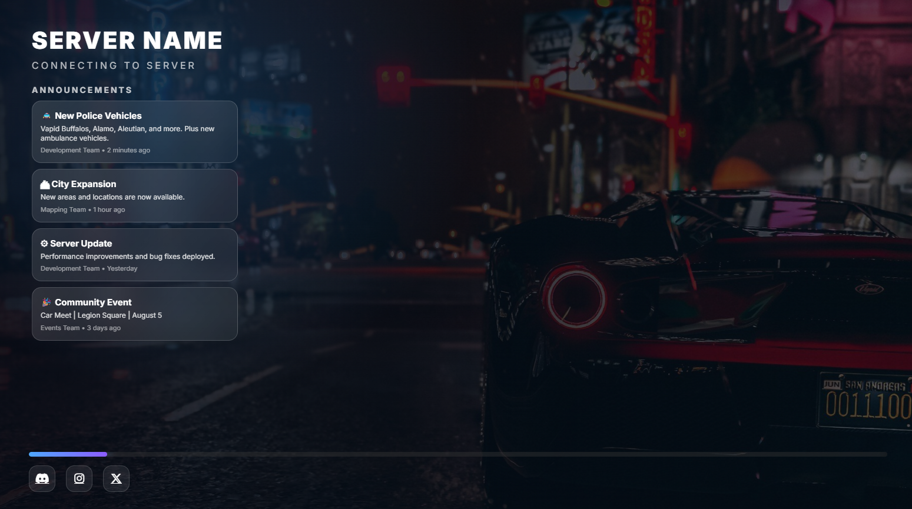

## Preview



# A loading screen for FiveM

This project includes a Discord announcement bridge for a FiveM loading screen.
The bot fetches messages from a Discord channel and writes them to `shared/announcements.json`, which the loading screen reads.

## What this does

- `server/bot.js` connects to Discord
- `server/api.js` exposes `/announcements` if you need a web API
- `shared/announcements.json` is the JSON file used by the loading screen
- `shared/config.js` is the client-side loading screen config

## Dependencies

Before setting this up, make sure you have:

- Node.js 18+ and npm
- A Discord bot account and a server where the bot can read messages
- Access to the announcement channel ID and server ID in Discord

The server-side bot dependencies are managed in `server/package.json` and can be installed with:

```bash
cd server
npm install
```

## Discord-only setup

This project is designed to work with a Discord bot that you create in the Discord Developer Portal. No database or external token storage is required.

You only need to:
- create a Discord bot
- enable the required bot intents
- get the bot token, server (guild) ID, and channel ID
- set those values in `server/config.json` or `server/.env`
- run `npm install` and `npm start` from `server/`

## Setup

### 1. Create a Discord Bot

1. Go to the Discord Developer Portal: https://discord.com/developers/applications
2. Create a new application.
3. Open the `Bot` tab and click `Add Bot`.
4. Copy the bot token.
5. Under `Privileged Gateway Intents`, enable:
   - `Message Content Intent`

### 2. Invite the bot to your server

1. Open the `OAuth2` tab and go to `URL Generator`.
2. Select `bot` scope.
3. Grant at least these bot permissions:
   - `Read Messages/View Channels`
   - `Read Message History`
   - `Send Messages` (optional for testing)
4. Copy the generated invite URL and open it.
5. Invite the bot to your server.

Make sure the bot also has access to the announcement channel itself with:
- `View Channel`
- `Read Message History`
- `Read Messages`

### 3. Get IDs

1. Enable Developer Mode in Discord:
   - `User Settings` → `Advanced` → `Developer Mode`
2. Right-click your server icon and choose `Copy ID` for `guildId`.
3. Right-click the announcement channel and choose `Copy ID` for `channelId`.

### 4. Update `server/config.json`

Open `server/config.json` and fill in the values:

```json
{
  "token": "YOUR_DISCORD_BOT_TOKEN",
  "guildId": "YOUR_SERVER_ID",
  "channelId": "ANNOUNCEMENT_CHANNEL_ID",
  "announcementLimit": 4,
  "outputFile": "../shared/announcements.json",
  "apiPort": 3010
}
```

> The bot also supports environment variables if you want to keep secrets out of source files.

You can set these values in a `.env` file inside `server/`:

```env
DISCORD_BOT_TOKEN=your_token_here
GUILD_ID=your_guild_id_here
CHANNEL_ID=your_channel_id_here
ANNOUNCEMENT_LIMIT=4
OUTPUT_FILE=../shared/announcements.json
```

A sample file is available at `server/.env.example`.

- `token`: your bot token from Discord Developer Portal
- `guildId`: server ID where the announcements channel exists
- `channelId`: ID of the channel with announcement messages
- `announcementLimit`: how many recent messages to fetch
- `outputFile`: file path used by the bot to save announcement JSON
- `apiPort`: optional port for `server/api.js`

## Preview mode vs server mode

- `previewMode: true` in `shared/config.js` is intended for browser preview and local design/testing.
- In preview mode, the loading screen uses simulated progress and sample announcement data.
- For actual FiveM server testing, set `previewMode: false` so the UI receives real progress events from `client/client.lua` and live announcements from `shared/announcements.json`.

### 5. Run the bot

From the `server` directory, run:

```bash
cd server
npm install
npm start
```

The bot will log in and update `shared/announcements.json` on the configured interval.

### 7. Run the API server (optional)

If you want to serve announcements over HTTP, run:

```bash
node api.js
```

Then visit `http://localhost:3010/announcements` to confirm it returns JSON.

## Troubleshooting

- If the loading screen shows no announcements, make sure `shared/announcements.json` exists and contains valid JSON.
- If the bot does not update the file, confirm the bot is running and that your Discord token, guild ID, and channel ID are correct.
- If the bot cannot read the channel, verify the bot has `View Channel`, `Read Message History`, and `Read Messages` permissions in that channel.
- If the bot is online but still not reading messages, check that the bot is actually invited to the server and that the channel ID is the announcement channel, not a different one.
- If you changed the bot configuration, restart the bot so it picks up the new settings.

## Notes

- The loading screen expects `shared/announcements.json` to exist and be valid JSON.
- You can store `DISCORD_BOT_TOKEN`, `GUILD_ID`, and `CHANNEL_ID` in a `.env` file instead of `server/config.json`.
- Keep your bot token secret.
